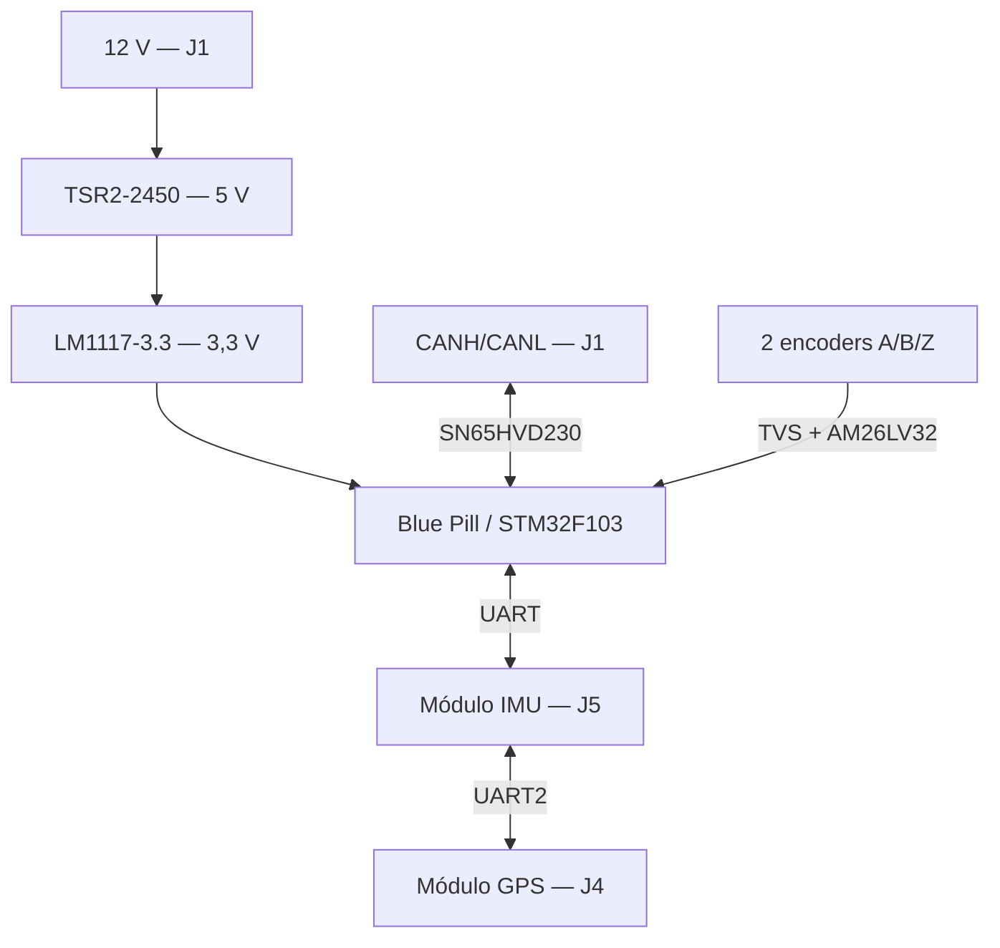

# Placa GPS/IMU e interface de encoders — RobSIC

Placa de aquisição e comunicação para o carrinho elétrico RobSIC, baseada em módulo STM32F103/Blue Pill. O hardware integra alimentação de 12 V, interface CAN, duas entradas de encoder incremental diferencial A/B/Z, conexão para módulo IMU, conexão para módulo GPS e interfaces de programação/depuração.

> **Status:** projeto em desenvolvimento e **não liberado para fabricação**. O relatório DRC fornecido registra 20 violações: 12 de máscara de solda, 5 de clearance, 1 texto espelhado e 2 conflitos de silk sobre cobre.

## Arquitetura



## Características extraídas dos arquivos

- KiCad: gerador `10.0`.
- Dimensão do contorno: `111 mm × 79 mm`.
- Componentes posicionados: 31.
- Roteamento: 415 segmentos e 50 vias.
- Alimentação de entrada nominal indicada: `+12 V`.
- Conversão: `TSR2-2450` para 5 V e `LM1117-3.3` para 3,3 V.
- CAN: `SN65HVD230`, com terminação de 120 Ω.
- Encoders: dois canais diferenciais A/B/Z, protegidos por `SRV05-4` e recebidos por `AM26LV32`.
- Controlador: módulo Blue Pill/STM32F103.

## Interfaces principais

| Conector | Função | Resumo |
|---|---|---|
| J1 | Alimentação e CAN | `+12 V`, `CANH`, `CANL`, `GND` |
| J2 | Encoder com nets `Esq` | `GND`, `+5 V`, pares diferenciais A/B/Z |
| J3 | Encoder com nets `Dir` | `GND`, `+5 V`, pares diferenciais A/B/Z |
| J4 | Módulo GPS | UART2, `+3.3V_GPS`, `GND` |
| J5 | Módulo IMU | UART, UART2 do GPS, SWD, reset, 3,3 V e GND |
| JTAG_IMU1 | Depuração da IMU | `NRST`, `SWDIO`, `SWCLK`; pino 4 está sem GND |

> Os valores visuais `J_Dir` e `J_Esq` estão trocados em relação aos nomes das redes do PCB: J2 carrega sinais `*_Esq` e J3 carrega sinais `*_Dir`. Use as redes e a tabela de pinagem como referência até corrigir a serigrafia/valor.

## Abrindo o projeto

1. Instale o KiCad 10 ou versão compatível mais recente.
2. Baixe a pasta completa, preservando todas as subpastas de footprints e `Kicad-STM32-master/`.
3. Abra `IMU_board.kicad_pro`.
4. Confira `fp-lib-table`; todas as entradas devem usar `${KIPRJMOD}` e caminhos relativos.
5. Corrija `sym-lib-table` antes de compartilhar: há referência a `${KIPRJMOD}/IMU_GPS_Blue_Pill/...` e um caminho absoluto `/home/ryan/...`, que não são portáveis na estrutura atual.
6. Abra as folhas hierárquicas `IMU.kicad_sch`, `GPS.kicad_sch` e `stm32f103.kicad_sch` pelo esquema principal.
7. Execute ERC e DRC novamente; não gere Gerbers enquanto houver violações.

## Estrutura recomendada para o GitHub

```text
gps-imu-interface-board/
├── README.md
├── BOM.csv
├── .gitignore
├── hardware/
│   ├── IMU_board.kicad_pro
│   ├── IMU_board.kicad_sch
│   ├── IMU_board.kicad_pcb
│   ├── GPS.kicad_sch
│   ├── IMU.kicad_sch
│   ├── stm32f103.kicad_sch
│   ├── fp-lib-table
│   ├── sym-lib-table
│   └── libraries/
├── firmware/
├── docs/
│   ├── HARDWARE.md
│   ├── FIRMWARE.md
│   ├── VALIDATION.md
│   └── GITHUB.md
├── manufacturing/
└── legacy/
```

## Documentos

- [Hardware e pinagem](docs/HARDWARE.md)
- [Firmware e mapa do STM32](docs/FIRMWARE.md)
- [Validação e DRC](docs/VALIDATION.md)
- [Preparação e envio ao GitHub](docs/GITHUB.md)
- [Lista de materiais](BOM.csv)

## Pendências críticas

- eliminar as 20 violações do DRC fornecido;
- corrigir as bibliotecas com caminhos absolutos ou diretórios inexistentes;
- corrigir a identificação J2/J3;
- adicionar GND ao cabeçalho de programação da IMU ou documentar ponto de referência externo;
- confirmar o footprint polarizado de C4, marcado como 100 nF;
- confirmar pinagem física dos módulos GPS e IMU com os respectivos datasheets;
- incluir firmware, configuração STM32CubeMX/CubeIDE e protocolo CAN;
- validar entrada de 12 V e proteções para uso veicular;
- gerar pacote de fabricação somente depois da liberação.

## Licença

Nenhuma licença foi definida. Antes de tornar o repositório público, escolha licenças compatíveis para hardware, firmware, bibliotecas de terceiros e documentação.

## Responsável

Vinícius Corcínio Silva — projeto RobSIC.

