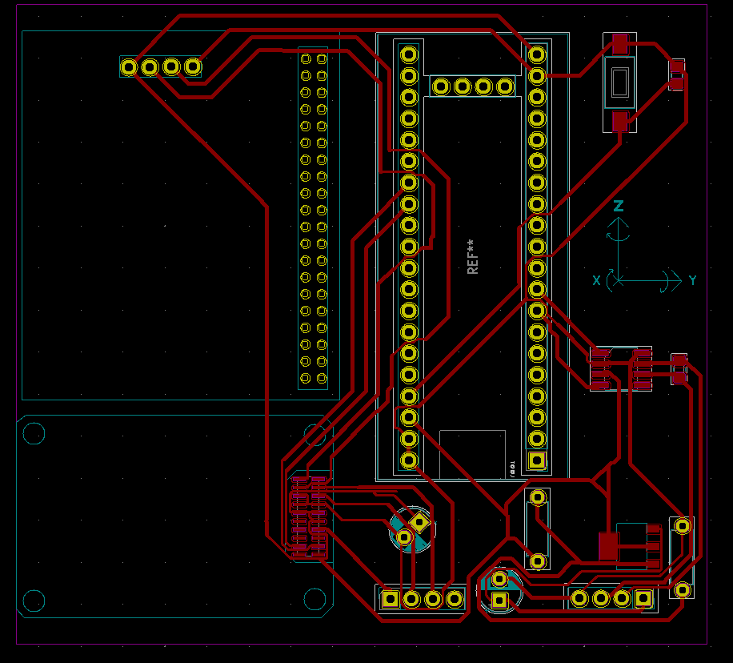
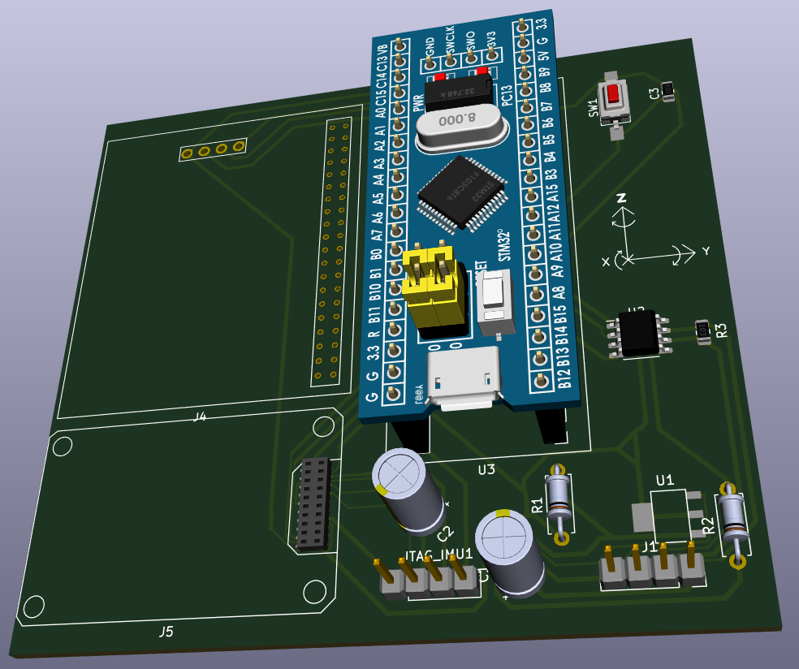

# Documentação Técnica — Placa GPS-IMU (Robsic)

> Documentação detalhada do funcionamento da placa integrada **GPS-IMU**, projeto
> `IMU_GPS_Blue_Pill`, desenvolvido em KiCad. Esta placa integra um módulo **GPS**,
> uma **IMU OpenIMU300ZI**, um microcontrolador **STM32F103 (Blue Pill)**, um
> **regulador de tensão LM1117-3.3** e um **transceiver CAN SN65HVD230**.

---

## 1. Introdução & Visão Geral

A placa GPS-IMU foi projetada para atuar como nó de aquisição inercial e de
posicionamento em um sistema embarcado maior (carrinho Robsic). Ela concentra,
em uma única PCB, os seguintes subsistemas:

- **Posicionamento** — receptor GPS conectado ao microcontrolador via UART2.
- **Atitude/Movimento** — IMU OpenIMU300ZI (Aceinna) conectada via UART.
- **Processamento** — STM32F103 (módulo Blue Pill).
- **Comunicação externa** — barramento CAN (transceiver SN65HVD230).
- **Alimentação** — regulador linear LM1117-3.3 que converte 12 V → 3,3 V.

### Representação 2D e 3D da placa

<p align="left" width="100%">
  
  
</p>

---

## 2. Arquitetura do Sistema

### Diagrama de blocos

```
                +-----------+                      +--------------------+
                |   GPS J4  |  UART2 (tx/rx)       |  STM32F103         |
                | 2x20 fêmea|  ------------------>  |  (Blue Pill U3)    |
                +-----------+                      +--------------------+
                                                         |     |
                                          UART           |     | CAN (tx/rx)
                                +--------------------+   |     |
                                |  IMU OpenIMU300ZI  |<--+     v
                                |      J5 (2x10)     |   +--------------------+
                                +--------------------+   |  SN65HVD230 (U2)   |
                                                         +--------------------+
                                                              |     |
                                                              v     v
                                                           canH    canL
                                                          (barramento CAN)


   Alimentação:
   +------+      +--------------+      +-------+
   | 12V  | ---> | LM1117-3.3   | ---> | 3,3V  | ---> GPS, IMU, STM32, CAN
   +------+      | (U1)         |      +-------+
                 +--------------+
                 C1 (10uF) entrada | C2 (100uF) saída | R1 (1k) / R2 (620 Ohm) feedback
```

### Hierarquia de esquemas (KiCad)

O projeto `IMU_board.kicad_pro` é dividido em 4 _sheets_:

| Sheet | Arquivo            | Função                                      |
|-------|--------------------|---------------------------------------------|
| 1/4   | `IMU_board.sch`    | Esquema raiz: regulador, CAN, conectores    |
| 2/4   | `IMU.sch`          | Sub-esquema da IMU (J5) e JTAG              |
| 3/4   | `GPS.sch`          | Sub-esquema do GPS (J4)                     |
| 4/4   | `stm32f103.sch`    | Sub-esquema do STM32 (Blue Pill)            |

---

## 3. Componentes Principais

### 3.1 GPS — Conector fêmea 2x20 (J4)

- **Referência:** `Conn_02x20_Top_Bottom` (J4)
- **Footprint:** `conn_gps_female_2x20:conn_gps_female_2x20`
  (footprint customizado, 40 pinos + 4 furos de montagem)
- **Alimentação:** +3,3 V (pino 4) e GND (pino 40)
- **Comunicação:** UART2 com o STM32
  - `uart2_tx_out_gps` — TX do GPS → RX do STM32 (UART2)
  - `uart2_rx_in_gps`  — TX do STM32 (UART2) → RX do GPS
- **Imagem de referência:** `image/gps.jpg`

### 3.2 IMU — OpenIMU300ZI (Aceinna)

- **Referência:** Conector 2x10 `Conn_02x10_Odd_Even` (J5)
- **Footprint:** `imu_connector_female_2x10:imu_connector_female_2x10`
- **Alimentação:** +3,3 V e GND
- **Comunicação principal:** UART com o STM32
  - `uart_tx_out_imu` — TX da IMU → RX do STM32
  - `uart_rx_in_imu`  — TX do STM32 → RX da IMU
- **Debug/Programação:** conector JTAG `JTAG_IMU1` (1x04, PinSocket 2,54 mm)
  - `swdio_imu`, `swclk_imu`, `nrst_imu`
- **Documentação oficial:**
  - https://www.aceinna.com/openimu
  - https://www.aceinna.com/inertial-systems/OpenIMU300ZI
- **Imagem de referência:** `image/imu.png`

### 3.3 MCU — STM32F103 (Blue Pill, U3)

- **Referência:** `YAAJ_BluePill_Part_Like_SWD_Breakout` (U3)
- **Footprint:** `Blue_pill:YAAJ_BluePill_SWD_2`
- **Biblioteca de símbolos:** `Kicad-STM32-master` (YAAJ)
- **Reset:** botão `SW1` (FSMSM) + capacitor `C3` (100 nF) para debounce
  — sinal `nrst`
- **Interfaces usadas:**
  - **UART2** — comunicação com o GPS
  - **UART** — comunicação com a IMU
  - **CAN** — `can_tx` / `can_rx` para o transceiver SN65HVD230
- **Alimentação:** +3,3 V e GND

### 3.4 Regulador de Tensão — LM1117-3.3 (U1)

- **Referência:** `componentes:LM1117-3.3` (U1)
- **Footprint:** `LM117IMPX3.3:LM1117IMP_3.3_NOPB`
- **Fabricante:** Texas Instruments
- **Função:** regulador linear LDO que converte a tensão de entrada `vcc_12`
  (12 V) para +3,3 V, alimentando todos os subsistemas da placa.
- **Circuito de suporte:**
  - **C1** — 10 µF (radial, P2,50 mm) — capacitor de entrada
  - **C2** — 100 µF (radial, P2,50 mm) — capacitor de saída
  - **R1** — 1 kΩ (axial DIN0207) — divisor de feedback
  - **R2** — 620 Ω (axial DIN0207) — divisor de feedback
- **Esquema de referência:** fornecido pelo Texas Instruments no datasheet do
  LM1117.
- **Imagem de referência:** `image/voltage_regulator.png`

### 3.5 Transceiver CAN — SN65HVD230 (U2)

- **Referência:** `stm32f103:u_SN65HVD230` (U2)
- **Footprint:** `Package_SO:SOIC-8_3.9x4.9mm_P1.27mm`
- **MPN:** `SN65HVD230MDREP`
- **Fabricante:** Texas Instruments
- **Função:** converte os sinais lógicos `can_tx`/`can_rx` do STM32 em sinais
  diferenciais `canH`/`canL` para o barramento CAN.
- **Terminação:** resistor **R3** de 120 Ω
  (`ERJ-P06F1200V`, SMD 0805) — terminação do barramento CAN.
- **Alimentação:** +3,3 V (pino VCC) e GND
- **Datasheet:** http://www.ti.com/lit/ds/symlink/sn65hvd230.pdf

---

## 4. Glossário de Sinais

| Sinal               | Direção | Roteamento (Origem → Destino)        | Sub-esquema  |
|---------------------|---------|--------------------------------------|--------------|
| `uart2_tx_out_gps`  | Saída   | GPS (J4) → STM32 (UART2 RX)          | GPS.sch      |
| `uart2_rx_in_gps`   | Entrada | STM32 (UART2 TX) → GPS (J4)          | GPS.sch      |
| `uart_tx_out_imu`   | Saída   | STM32 → IMU (J5)                     | stm32f103.sch|
| `uart_rx_in_imu`    | Entrada | IMU (J5) → STM32                      | stm32f103.sch|
| `can_tx`            | Saída   | STM32 → SN65HVD230 (U2)              | stm32f103.sch|
| `can_rx`            | Entrada | SN65HVD230 (U2) → STM32              | stm32f103.sch|
| `canH`              | Saída   | SN65HVD230 → barramento CAN          | IMU_board.sch|
| `canL`              | Saída   | SN65HVD230 → barramento CAN          | IMU_board.sch|
| `vcc_12`            | Pot.   | Fonte externa (12 V) → LM1117         | IMU_board.sch|
| `+3.3V`             | Pot.   | LM1117 saída → GPS, IMU, STM32, CAN   | todos        |
| `GND`               | Pot.   | Referência comum                      | todos        |
| `swdio_imu`         | I/O    | Debug IMU (JTAG_IMU1)                 | IMU.sch      |
| `swclk_imu`         | Saída  | Clock debug IMU (JTAG_IMU1)           | IMU.sch      |
| `nrst_imu`          | Saída  | Reset debug IMU (JTAG_IMU1)           | IMU.sch      |
| `nrst`              | I/O    | Reset do STM32 (SW1 + C3)             | stm32f103.sch|

> **Convenção de nomenclatura:** os sinais seguem o padrão
> `<interface>_<direção>_<destino>`. Por exemplo, `uart2_tx_out_gps` indica
> o pino TX da UART2 que sai do STM32 em direção ao GPS.

---

## 5. Fluxo de Comunicação

### 5.1 GPS ↔ STM32 (UART2)

```
   GPS (J4)                        STM32 (Blue Pill U3)
   --------                        --------------------
   pino 29 (uart2_tx_out_gps) ---> UART2_RX (entrada)
   pino 30 (uart2_rx_in_gps)  <--- UART2_TX (saída)
```

O GPS envia sentenças NMEA (ou dados binários) pela UART2 ao STM32, que por
sua vez pode enviar comandos de configuração de volta ao GPS.

### 5.2 STM32 ↔ IMU OpenIMU300ZI (UART)

```
   STM32 (Blue Pill U3)            IMU (J5)
   -----------------------         ---------
   uart_tx_out_imu  ------------>  uart_rx_in_imu
   uart_rx_in_imu   <------------  uart_tx_out_imu
```

A IMU envia quadros de dados inerciais (acelerômetro/giroscópio) ao STM32.
Programação/depuração ocorre via SWD (`swdio`, `swclk`, `nrst`) pelo conector
`JTAG_IMU1`.

### 5.3 STM32 ↔ Barramento CAN (via SN65HVD230)

```
   STM32 (U3)                     SN65HVD230 (U2)              Barramento CAN
   ----------                     ---------------              ---------------
   can_tx  ---------------------->  D   (TX)                     canH
   can_rx  <----------------------  R   (RX)                      canL
                                                     |
                                                R3 (120 Ω)  -- terminação
```

O STM32 envia frames CAN ao transceiver, que os converte em sinais
diferenciais `canH`/`canL`. Um resistor de terminação de 120 Ω (R3) é
previsto na placa.

### 5.4 Seletor de Interface — Pino 7 (UART/SPI)

Conforme observações do projeto, o **pino 7** do conector IMU atua como
seletor de interface de comunicação entre **UART** e **SPI**. Consulte a
imagem `image/obs.png` para detalhes de configuração do jumper/seleção.

---

## 6. Alimentação

### Topologia de potência

```
            +-------------------+
   12 V --->|  Entrada          |   C1 (10 µF)        C2 (100 µF)
   (vcc_12) |  LM1117-3.3 (U1)  |----||----+--------||----+---> +3,3 V
            |                   |          |              |
            +-------------------+          GND            GND

   Divisor de feedback:  R1 (1 kΩ) --- R2 (620 Ω)  -> define a tensão de saída
```

### Distribuição dos 3,3 V

A saída +3,3 V do LM1117 alimenta diretamente:

| Subsistema | Componente | Pino de alimentação    |
|------------|------------|------------------------|
| GPS        | J4         | Pino 4 (+3,3 V)        |
| IMU        | J5         | Pino de +3,3 V         |
| STM32      | U3 (Blue Pill) | Pino +3,3 V       |
| CAN        | U2 (SN65HVD230) | Pino VCC (+3,3 V) |

A referência de terra comum (GND) é compartilhada por todos os subsistemas.

### Notas

- O esquema do regulador é baseado no circuito típico fornecido pela Texas
  Instruments no datasheet do LM1117.
- Os capacitores C1 e C2 garantem a estabilidade do LDO e devem ser
  posicionados próximos aos pinos de entrada/saída do U1.

---

## 7. Conectores & Pinagem

### 7.1 Conector GPS — J4 (2x20 Top/Bottom)

- **Referência:** `Conn_02x20_Top_Bottom` (J4)
- **Footprint:** `conn_gps_female_2x20`
- **Pinos ativos:** 4 (+3,3 V), 29 (TX), 30 (RX), 40 (GND)
- **Demais pinos:** não conectados (NoConn) conforme `GPS.sch`
- **Imagens de referência:** `image/interface_conn.png`,
  `image/info_pin_1.png`, `image/info_pin_2.png`

> Na convenção de pinos do conector 2x20, os **pinos ímpares** estão na
> coluna esquerda e os **pares** na direita. A numeração começa no topo.

| Pino | Função                 | Sinal / Tensão        | Status      |
|------|------------------------|----------------------|-------------|
| 1    | —                      | —                    | NoConn      |
| 2    | —                      | —                    | NoConn      |
| 3    | —                      | —                    | NoConn      |
| **4**| **Alimentação**        | **+3,3 V**           | **Ativo**   |
| 5    | —                      | —                    | NoConn      |
| 6    | —                      | —                    | NoConn      |
| 7    | Seletor UART/SPI       | (configuração)       | Ver obs.png |
| 8    | —                      | —                    | NoConn      |
| 9    | —                      | —                    | NoConn      |
| 10   | —                      | —                    | NoConn      |
| 11   | —                      | —                    | NoConn      |
| 12   | —                      | —                    | NoConn      |
| 13   | —                      | —                    | NoConn      |
| 14   | —                      | —                    | NoConn      |
| 15   | —                      | —                    | NoConn      |
| 16   | —                      | —                    | NoConn      |
| 17   | —                      | —                    | NoConn      |
| 18   | —                      | —                    | NoConn      |
| 19   | —                      | —                    | NoConn      |
| 20   | —                      | —                    | NoConn      |
| 21   | —                      | —                    | NoConn      |
| 22   | —                      | —                    | (montagem)  |
| 23   | —                      | —                    | NoConn      |
| 24   | —                      | —                    | NoConn      |
| 25   | —                      | —                    | NoConn      |
| 26   | —                      | —                    | NoConn      |
| 27   | —                      | —                    | NoConn      |
| 28   | —                      | —                    | NoConn      |
| **29**| **Comunicação**       | **uart2_tx_out_gps** | **Ativo**   |
| **30**| **Comunicação**       | **uart2_rx_in_gps**  | **Ativo**   |
| 31   | —                      | —                    | NoConn      |
| 32   | —                      | —                    | NoConn      |
| 33   | —                      | —                    | NoConn      |
| 34   | —                      | —                    | NoConn      |
| 35   | —                      | —                    | (montagem)  |
| 36   | —                      | —                    | NoConn      |
| 37   | —                      | —                    | NoConn      |
| 38   | —                      | —                    | NoConn      |
| 39   | —                      | —                    | NoConn      |
| **40**| **Alimentação**       | **GND**              | **Ativo**   |

> Os pinos 22 e 35 correspondem aos furos de montagem do footprint
> `conn_gps_female_2x20` (diam. 1,0 mm), não são sinais funcionais.

### 7.2 Conector IMU — J5 (2x10 Odd/Even)

- **Referência:** `Conn_02x10_Odd_Even` (J5)
- **Footprint:** `imu_connector_female_2x10:imu_connector_female_2x10`

| Pino | Função                 | Sinal                |
|------|------------------------|----------------------|
| —    | Alimentação            | +3,3 V               |
| —    | Referência            | GND                  |
| —    | RX da IMU             | `uart_rx_in_imu`     |
| —    | TX da IMU             | `uart_tx_out_imu`    |
| —    | SWDIO (debug)         | `swdio_imu`          |
| —    | SWCLK (debug)         | `swclk_imu`          |
| —    | Reset (debug)         | `nrst_imu`           |

> Para a correspondência exata de cada pino, consulte o símbolo do conector
> no esquema `IMU.sch` e a imagem `image/info_pin_1.png`.

### 7.3 Conector JTAG/Debug IMU — JTAG_IMU1 (1x04)

- **Referência:** `Conn_01x04` (JTAG_IMU1)
- **Footprint:** `Connector_PinSocket_2.54mm:PinSocket_1x04_P2.54mm_Vertical`

| Pino | Função       | Sinal        |
|------|--------------|--------------|
| 1    | Reset        | `nrst_imu`   |
| 2    | SWDIO        | `swdio_imu`  |
| 3    | SWCLK        | `swclk_imu`  |
| 4    | GND          | GND          |

### 7.4 Conector de Saída CAN — J1 (1x04)

- **Referência:** `Conn_01x04` (J1)
- **Footprint:** `Connector_PinSocket_2.54mm:PinSocket_1x04_P2.54mm_Vertical`

| Pino | Função       | Sinal / Tensão |
|------|--------------|----------------|
| 1    | Alimentação  | `vcc_12` (12 V)|
| 2    | CAN High     | `canH`         |
| 3    | CAN Low      | `canL`         |
| 4    | Referência   | GND            |

---

## 8. Observações & Notas de Aplicação

### 8.1 Seletor de Interface UART/SPI (Pino 7)

O **pino 7** do conector IMU atua como seletor de interface de comunicação.
Quando configurado adequadamente, permite alternar entre os modos **UART**
e **SPI**. Consulte a imagem `image/obs.png` para detalhes de configuração.

### 8.2 Conexão das Portas Seriais

- **UART2** do STM32 é dedicada à comunicação com o **GPS**.
- A **UART principal** do STM32 é dedicada à comunicação com a **IMU**.
- Ambas operam em nível lógico **3,3 V** (compatibilidade direta com o
  STM32F103).

### 8.3 Barramento CAN

A comunicação externa da placa ocorre via barramento CAN, usando o
transceiver **SN65HVD230**`. Recomenda-se:

- Utilizar cabo par tranado para `canH`/`canL`.
- Garantir a terminação de 120 Ω em ambas as extremidades do barramento
  (o resistor **R3** já provê uma das terminações na placa).
- Tensão de alimentação do transceiver: 3,3 V.

### 8.4 Imagens de Referência Adicionais

| Imagem                    | Conteúdo                                      |
|---------------------------|-----------------------------------------------|
| `image/obs.png`           | Alimentação, portas seriais e seletor pin_7   |
| `image/type_comm.png`     | Tipos de comunicação suportados               |
| `image/info_pin_1.png`    | Tabela de informações dos pinos (parte 1)     |
| `image/info_pin_2.png`    | Tabela de informações dos pinos (parte 2)     |
| `image/interface_conn.png`| Conector de interface                          |

---

## 9. Referências

- **LM1117 — LDO Linear Regulator**, Texas Instruments:
  https://www.ti.com/product/LM1117
- **SN65HVD230 — CAN Transceiver**, Texas Instruments:
  http://www.ti.com/lit/ds/symlink/sn65hvd230.pdf
- **OpenIMU300ZI**, Aceinna:
  https://www.aceinna.com/inertial-systems/OpenIMU300ZI
- **OpenIMU (plataforma aberta)**, Aceinna:
  https://www.aceinna.com/openimu
- **STM32 Blue Pill (símbolos/footprints YAAJ)**, repositório
  `Kicad-STM32-master` incluído em `IMU_GPS_Blue_Pill/`.
- **Esquemas do projeto:** `IMU_GPS_Blue_Pill/IMU_board.kicad_pro`.

---

## 10. Mapa de Arquivos do Projeto

```
IMU_GPS_Blue_Pill/
├── IMU_board.kicad_pro          # arquivo de projeto KiCad (raiz)
├── IMU_board.kicad_sch          # esquema raiz (versão nova)
├── IMU_board.sch                # esquema raiz (versão legada)
├── IMU_board.kicad_pcb          # PCB
├── IMU.sch / IMU.kicad_sch      # sub-esquema IMU
├── GPS.sch                      # sub-esquema GPS
├── stm32f103.sch                # sub-esquema STM32
├── conn_gps_female_2x20.pretty/# footprint do conector GPS
├── RBS_stm32f103.pretty/        # footprints customizados (STM32, relé, step-down)
├── Kicad-STM32-master/          # biblioteca YAAJ Blue Pill
├── trilhas/                     # arquivos de roteamento (freerouting .dsn/.ses)
└── IMU_board-backups/           # backups datados do projeto
```

---

**Fim da documentação.** Para dúvidas sobre o projeto, consulte os esquemas
 `.sch` no KiCad ou entre em contato com a equipe Robsic.
